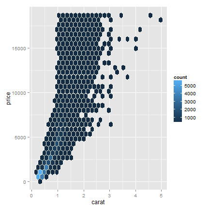

R_Intro
========================================================
author: Joe Mienko, Richard Smith, and Gregor Passolt
date: 
font-import: http://www.google.com/fonts/specimen/Istok+Web


Our Goals
========================================================

By the end of this workshop we hope you...
- Have R and RStudio installed on your computer (if you brought one)
- Have an ability to perform basic R tasks
- Have an understanding of how to get help in R

We also hope you leave with a appreciation of R's capabilities such as...
- Fancy graphs
- Replicable and transparent research
- Cutting-edge statistical models


Installing R
========================================================

Text describing how to install R from CRAN

Installing RStudio
========================================================

Text describing how to install RStudio

Getting Data into R
========================================================

- Sources of available data (try to use POC data)
- Scripting vs. Interactive approaches
- Good social work example of data? (our preference would be our foster care data)

Working with Data in R
========================================================

- How Data (and other things) Are Stored in R

- Description of data frames

- Objects

- How to subset data

- `foreign` package

Basic R Commands
========================================================

Summary


```r
summary(cars)
```

```
     speed           dist    
 Min.   : 4.0   Min.   :  2  
 1st Qu.:12.0   1st Qu.: 26  
 Median :15.0   Median : 36  
 Mean   :15.4   Mean   : 43  
 3rd Qu.:19.0   3rd Qu.: 56  
 Max.   :25.0   Max.   :120  
```


Basic R Commands
========================================================

Mean


```r
mean(cars$speed)
```

```
[1] 15.4
```


Median


```r
median(cars$speed)
```

```
[1] 15
```


Plotting Data
========================================================


```r
plot(cars)
```

 


Basic Regression Model
========================================================


```r
m1 <- lm(cars$dist ~ cars$speed)
m1
```

```

Call:
lm(formula = cars$dist ~ cars$speed)

Coefficients:
(Intercept)   cars$speed  
     -17.58         3.93  
```


Getting Help in R
========================================================


```r
?mean
```


Also, Stack Overflow

Fancy Graphs
========================================================


```r
library(ggplot2)
library(hexbin)
d <- ggplot(diamonds, aes(carat, price)) + 
      stat_binhex(colour="white")
d
```




Replicable, Transparent Research
========================================================

- `knitr`
- tex
- markdown
- `pandoc`
- writing loops

Different Types of Models
========================================================
- Event History (`survival` package)
- logit or probit (`glm` package)
- mixed effect or HLM (`lmer` package, `coxme` package)
- latent variable models (`lavaan` package)


Other Models...
========================================================
- CRAN repository
- GitHub


